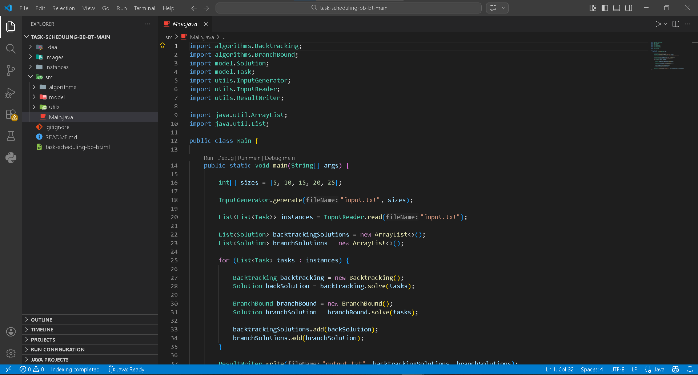
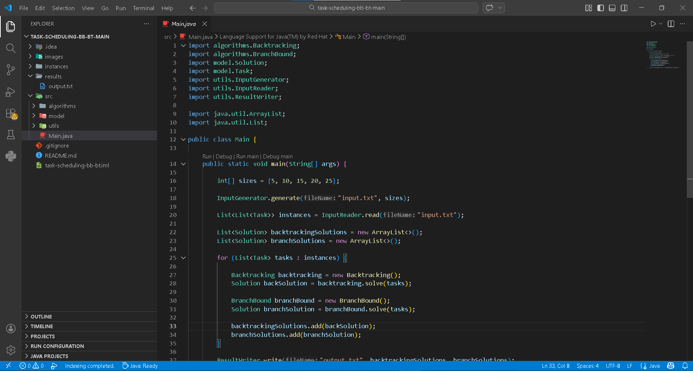

# 📝 Task Scheduling

## 📋 Sumário  
- [🎯 Descrição](#-descrição)  
- [📦 Pré-requisitos](#-pré-requisitos) 
- [🛠️ Preparando o Ambiente](#-preparando-o-ambiente)  
  - [💻 Windows](#-windows)  
  - [🐧 Linux](#-linux)
  - [🍎 MacOS](#-macos)
- [🚀 Instruções de Uso](#-instruções-de-uso)
- [👥 Equipe Envolvida](#-equipe-envolvida)

---

## 🎯 Descrição
Este projeto tem como objetivo implementar e analisar formalmente os paradigmas clássicos de projetos de algoritmos 
na resolução do problema de escalonamento de tarefas. 

### 🔍 Objetivo Principal (Primeira Etapa):
O objetivo central desta etapa é implementar e analisar comparativamente as estratégias de Backtracking e Branch and Bound.


### ✅ Atividades Realizadas (Primeira Etapa):

Utilização do arquivo "games.csv" para as seguintes transformações:

- 🧮 Implementação do algoritmo Backtracking.
  - Código desenvolvido e validado para aplicação em instâncias de teste.
  - Arquivo: "Backtracking.java"

- 🧮 Implementação do algoritmo Branch and Bound.
  - Código desenvolvido e validado para aplicação em instâncias de teste.
  - Arquivo: "BranchBound.java"

- 📂 Criação de instâncias de entrada  
  - Arquivo preparado para aplicação dos algoritmos, visando análise formal de êxito e eficiência.
  - Arquivo: "input.txt"
 
- 📑 Geração de arquivos de saída
  - Resultados produzidos após execução dos algoritmos sobre os inputs definidos.
  - Pasta gerada: "results"
  - Arquivo gerado: "output.txt"
 
- ⏱️ Aplicação de métricas de desempenho
  - Utilização do nanoTime para análise detalhada de tempo de execução e eficiência comparativa

### Implementação da Ferramenta

A ferramenta foi desenvolvida em Java, estruturada em pacotes distintos para organização das classes e funcionalidades.


- 🧩 Algoritmos Implementados
- Backtracking: busca sistemática explorando todas as combinações possíveis de tarefas, com controle de nós explorados.
- Branch and Bound: busca com poda, utilizando cálculo de upper bound para reduzir o espaço de busca.
  
- 📂 Geração de Instâncias de Entrada (.txt)
- Classe InputGenerator: responsável por criar arquivos contendo diferentes conjuntos de tarefas, com atributos de tempo de processamento, deadline e valor.
  
- 📖 Leitura das Instâncias
- Classe InputReader: responsável por interpretar os arquivos .txt e transformar os dados em listas de tarefas (Task).
  
- 📝 Escrita dos Resultados
- Classe ResultWriter: gera arquivos .txt com as soluções propostas por cada algoritmo, incluindo valor obtido e conjunto de tarefas selecionadas.
  
- ⏱️ Métricas de Desempenho
- Utilização de nanoTime para medir tempo de execução e análise de eficiência.
- Registro do número de nós explorados em cada execução para comparação formal entre os algoritmos.


---

## 📦 Pré-Requisitos
- Java JDK 25 (LTS) ou superior
- IDE compatível (ex.: IntelliJ IDEA, Eclipse ou VS Code) ou uso do javac/java via terminal.
- Sistema operacional com suporte a Java (Windows, Linux ou macOS).


## 🛠️ Preparando o Ambiente

### 💻 Windows

#### 1. Instalando o JDK
- Baixe e instale a versão Java JDK 25 (LTS) ou superior no [site da Oracle](https://www.oracle.com/br/java/technologies/downloads/#jdk23-windows)

#### 2. Configurando o Visual Studio Code
- Instale o [Visual Studio Code](https://code.visualstudio.com/docs/setup/windows)  
- Adicione o ["Extension Pack for Java"](https://marketplace.visualstudio.com/items?itemName=vscjava.vscode-java-pack)

---

### 🐧 Linux
📌 **Foco no Ubuntu**: As instruções abaixo são específicas para a distribuição Ubuntu. Se você utiliza outra distribuição Linux:
- Consulte a documentação oficial do seu sistema
- Adapte os comandos conforme necessário
- Pesquise por guias específicos para sua distro (Arch, Fedora, etc)

 **Dica**: A maioria dos comandos pode ser adaptada trocando o gerenciador de pacotes (ex: `apt` → `dnf` para Fedora)

#### 1. Instalando o JDK
- Tutorial: [Como instalar o JDK no Ubuntu](https://www.hostinger.com.br/tutoriais/como-instalar-java-no-ubuntu)

#### 2. Configurando o VS Code
 - Instale o [VS Code para Linux](https://code.visualstudio.com/docs/setup/linux)  
- Adicione o ["Extension Pack for Java"](https://marketplace.visualstudio.com/items?itemName=vscjava.vscode-java-pack)


---

### 🍎 MacOS

#### 1. Instalando o JDK
-  Baixe o Java JDK 25 (LTS) ou superior na [ Oracle](https://www.oracle.com/br/java/technologies/downloads/#jdk23-mac)

#### 2. Configurando o VS Code
- Instale o [VS Code para Mac](https://code.visualstudio.com/docs/setup/mac)  
- Adicione o ["Extension Pack for Java"](https://marketplace.visualstudio.com/items?itemName=vscjava.vscode-java-pack)

---


## 🚀 Instruções de Uso

Após instalar o Java (JDK) e o Visual Studio Code, podemos, de fato, prosseguir para a execução do programa desenvolvido.

1. Clone o repositório:  
   ```bash
   git clone https://github.com/MarcellaLins/task-scheduling-bb-bt.git
   ````

2. Ou baixe como .zip e descompacte.

3. Abra o projeto no Visual Studio Code (ou na IDE de sua preferência) e execute a classe "Main.java".

    **Antes da execução:**
    

    **Depois da execução:**
    

📁 Todos os arquivos gerados serão salvos no mesmo diretório ``results``.


## 👥 Equipe Envolvida

<table>
  <tr>
    <td align="center">
      <a href="https://github.com/Antonio-Lins">
        <br />
        <sub><b>Antônio Lins</b></sub>
      </a><br />
    </td>
    <td align="center">
      <a href="https://github.com/ArturOliveir4">
        <br />
        <sub><b>Artur Oliveira</b></sub>
      </a><br />
    </td>
    <td align="center">
      <a href="https://github.com/MarcellaLins">
        <br />
        <sub><b>Marcela Lins</b></sub>
      </a><br />
    </td>
  </tr>
</table>
